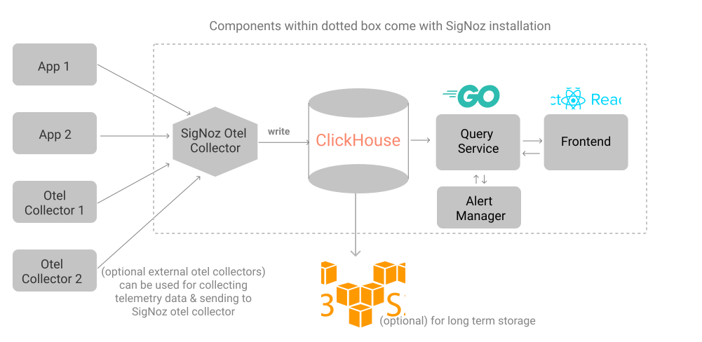
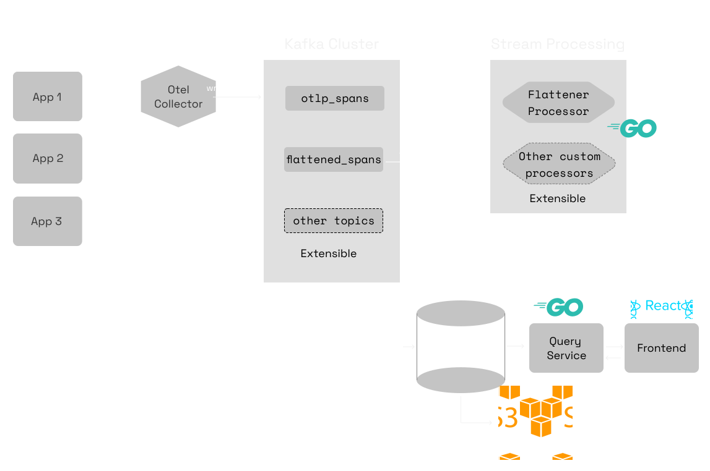

SigNoz supports two storage setups, one based on ClickHouse and another based on Kafka + Druid. Depending upon your preference you can choose any of the two

## ClickHouse setup Architecture

### Architecture Components

- OpenTelemetry Collector
- ClickHouse
- Query Service
- Frontend

## Kafka + Druid Setup Architecture

SigNoz uses industry proven Kafka and Druid to power highly scalable data ingestion and realtime data analysis.

### Architecture Components

- OpenTelemetry Collector
- Kafka
- Stream Processors
- Apache Druid
- Query Service
- Frontend

**OpenTelemetry Collector** can receive data in multiple formats. It currently has receivers for below formats

- Jaeger Receiver
- Kafka Receiver
- OpenCensus Receiver
- OTLP Receiver
- Zipkin Receiver

OpenTelemetry Collector then exports those traces to a kafka topic, `otlp_spans`.

**Apache Kafka is a distributed streaming platform** that can be used as message-driven backbone of communication. Applications can send messages between its components in the form of records that can be produced to Kafka topics and consumed from Kafka topics.

### _Stream Processing_ decentralizes and decouples the infrastructure.

You produce at whatever rate you want to into Kafka, scaling the brokers out to accommodate the ingest rate. You then consume as you want to; Kafka persists the data and tracks the offset of the consumers as they work their way through the data they read.
This behavior enables applications to be able to recover from outages, enables decoupling between application components, and encourages the use of backpressure within reactive application

Our stream processing applications read from `otlp_spans` kafka topic and flattens the structure of spans to be ingested to databases like Druid. This flattener-processor writes to `flattened_spans` topic in kafka.

We can easily build other processors for any processing we may want to do. For example:

- Remove PII data from spans
- Send input to anomaly detection framework

The flattened data is then ingested to **Druid** _which is a real-time analytics database_ designed for fast slice-and-dice analytics ([OLAP](https://en.wikipedia.org/wiki/Online_analytical_processing) queries) on large data sets. We use streaming ingestion from Kafka to Druid.

- We then add supervisor in druid to ingest from kafka at realtime
- We then add retention policy in druid. By default, we set 3 days of data retention
- We have option to add AWS S3 bucket credentials for deep storage of data in druid. By default, we use `storage: local` in helm `values.yaml`

**Query Service** is the interface between Frontend and Druid. It provides APIs to be consumed by frontend application and queries Druid to fetch data and processes data before responding back to the frontend.

**Frontend** is the UI, built in ReactJS and Typescript and provides advanced trace/span filtering capabilities and plot metrics to give service overviews.
