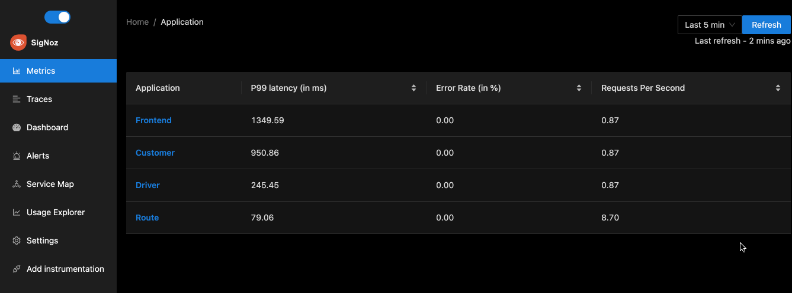

import Tabs from "@theme/Tabs";
import TabItem from "@theme/TabItem";

<p align="center">

[](https://calendly.com/pranay-signoz/instrumentation-office-hrs)

</p>

### Introduction to SigNoz for FastAPI

SigNoz can help you monitor your FastAPI applications for application related metrics like latency, request per second, error rates, etc. It can also monitor infrastructure metrics like CPU utilization and memory usage.

You can set alerts on metrics of your choice to stay on top of any issues arising in your deployed application.

### Getting started for FastAPI with SigNoz

SigNoz uses <a href = "https://opentelemetry.io/" rel="noopener noreferrer nofollow" target="_blank" >OpenTelemetry</a> for enabling your application code to generate telemetry data. OpenTelemetry provides a vendor-neutral <a href = "https://github.com/open-telemetry/opentelemetry-specification" rel="noopener noreferrer nofollow" target="_blank" >specification</a>  to instrument your application so that you can export data to any backend of your choice, such as SigNoz.

Let us see how to instrument your application with OpenTelemetry, so that you can visualize the data with SigNoz.

### Instrumenting a sample FastAPI application with OpenTelemetry

**Prerequisites**
Python 3.6 or newer

1. **Running sample FastAPI app**<br></br>
   We will be using the FastAPI app at this [Github repo](https://github.com/SigNoz/sample-fastAPI-app).

   ```jsx
   git clone https://github.com/SigNoz/sample-fastAPI-app.git
   cd sample-fastapi-app/
   cd app
   ```

2. **Install necessary OpenTelemetry Python packages**<br></br>
   
   ```jsx
   pip3 install -r requirements.txt
   ```
   
   The `requirements.txt` file contain all the necessary OpenTelemetry packages.

3. **Install application specific packages**<br></br>
   
   ```jsx
   opentelemetry-bootstrap --action=install
   ```

4. **Configure environment variables to run app and send data to SigNoz**<br></br>
   
   :::caution
   Run this command at your terminal after replacing the environment variables applicable for your setup.
   :::

   Now you need to run your application with some environment variables for OpenTelemetry. Environment variables that need to be configured:

   a. `IP of SigNoz backend` - IP of the machine where SigNoz is installed. In case you have installed SigNoz on your local machine, you can use `localhost`

   b. `service name` - the service you are monitoring (you can name it anything)

   :::note
   Don’t run app in reloader/hot-reload mode as it breaks instrumentation.
   :::

   You need to put these environment variables in the below command and run it at your terminal.

   ```jsx
   OTEL_RESOURCE_ATTRIBUTES=service.name=<service_name> \
   OTEL_EXPORTER_OTLP_ENDPOINT="http://<IP of SigNoz>:4317" \
   opentelemetry-instrument uvicorn main:app --host localhost --port 5002
   ```

   If you're running SigNoz on localhost, and want to name your service as fastapiApp, the final command will be as follows:
   ```jsx
   OTEL_RESOURCE_ATTRIBUTES=service.name=fastapiApp \
   OTEL_EXPORTER_OTLP_ENDPOINT="http://localhost:4317" \
   opentelemetry-instrument uvicorn main:app --host localhost --port 5002
   ```
   You can check if your application is running or not by hitting the endpoint at [http://localhost:5002/](http://localhost:5002/).

5. **Generate load on your app to see data on SigNoz dashboard**<br></br>
   You can use locust for this load testing.

   ```jsx
   pip3 install locust
   ```

   <br></br>

   ```jsx
   locust -f locust.py --headless --users 10 --spawn-rate 1 -H http://localhost:5002
   ```

   Now refresh the SigNoz dashboard. You should see your service `fastapiApp` in the list of applications monitored on SigNoz dashboard as shown below.

   

---

### Instructions for running with Docker
1. **Build Docker image**

   ```jsx
   docker build -t sample-fastapi-app .
   ```

2. **Setting environment variables**
   
   ```jsx
   # If you have your SigNoz IP Address, replace <IP of SigNoz> with your IP Address. 

   docker run -d --name fastapi-container \
   -e OTEL_METRICS_EXPORTER='none' \
   -e OTEL_RESOURCE_ATTRIBUTES='service.name=fastapiApp' \
   -e OTEL_EXPORTER_OTLP_ENDPOINT='http://<IP of SigNoz>:4317' \
   -p 5002:5002 sample-fastapi-app
   ```

   If you're using docker-compose setup:

   ```jsx
   # If you are running signoz through official docker-compose setup, run `docker network ls` and find clickhouse network id. It will be something like this clickhouse-setup_default 
   # and pass network id by using --net <network ID>

   docker run -d --name fastapi-container \ 
   --net clickhouse-setup_default  \ 
   --link clickhouse-setup_otel-collector_1 \
   -e OTEL_METRICS_EXPORTER='none' \
   -e OTEL_RESOURCE_ATTRIBUTES='service.name=fastapiApp' \
   -e OTEL_EXPORTER_OTLP_ENDPOINT='http://clickhouse-setup_otel-collector_1:4317' \
   -p 5002:5002 sample-fastapi-app
   ```


