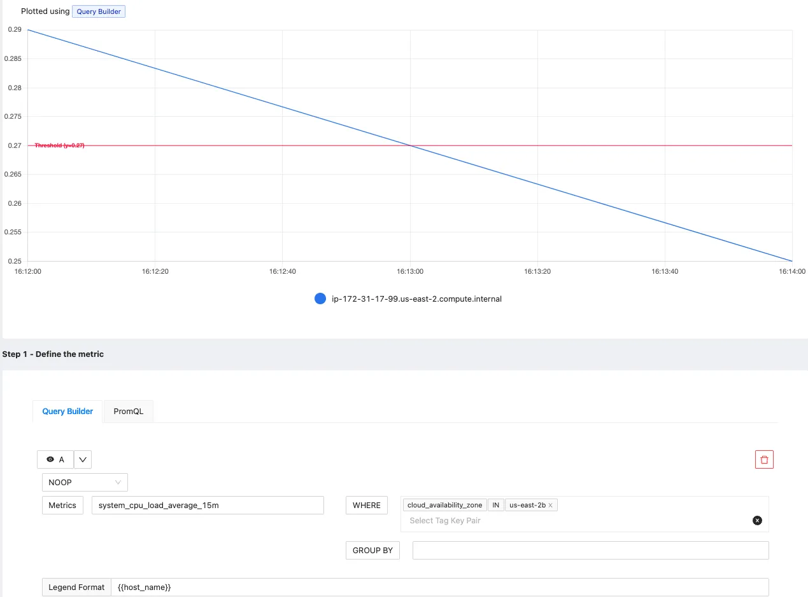
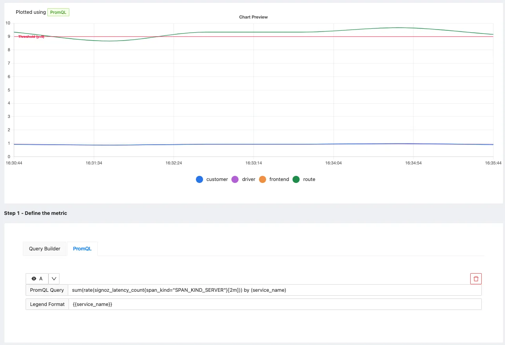
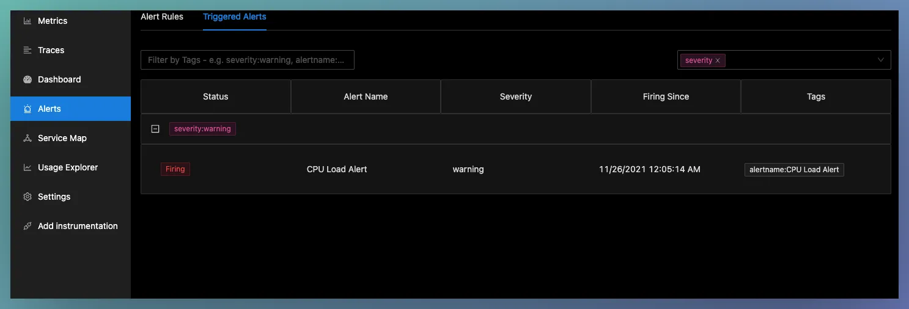
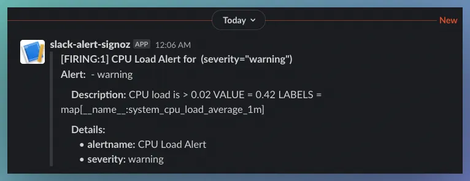

import { LiteYoutubeEmbed } from "react-lite-yt-embed";

# Setting alerts in SigNoz  

Starting with [v0.10.0](https://github.com/SigNoz/signoz/releases/tag/v0.10.0) you can set alerts on metrics using query builder.


## Setting Alert Rules

You can set Alert Rules in SigNoz in the following 2 ways:
1. Query Builder - This is DIY way to build alerts by selecting metrics from dropdowns. You can also set filter and group by conditions by selecting options from the dashboard.
2. PromQL - You can use [Prometheus Query Language](https://prometheus.io/docs/prometheus/latest/querying/basics/) to write expressions for alerts which will be evaluated in regular time interval. If you have set up alerts in Prometheus, this method should be very familiar.


#### Alert Rules

Navigate to Alerts page from the left panel. It has 2 tabs:

1. Alert Rules
2. Triggered Alerts

Alert Rules set the expression you want to evaluate to start firing alerts. The Alert Rules tab shows a list of currently configured alert rules and labels like `severity` and `Alert Name`. It also shows the current status of this Alert rules. If any alerts are `firing` because of this or everything is `Ok`


#### Create Alert Rules

To create new alert rules, you can click the `New Alerts` button. This would open a pane with an empty graph. As mentioned above, there are 2 ways to create Alert Rules

1. Query Builder
2. PromQL

##### Query Builder
In Query Builder, you can use the dropdowns in the dashboard to select the right metric. 
- Then create an expression with WHERE and GROUPBY clauses which represents the expression to evaluate for alerting
- Threshold which the value of expression should cross ( above or below) to trigger an alert.
- Evaluation period of the expression
- Set name, descriptions and tags about the alert to make it more informative




##### PromQL

In PromQL, you can write the Prometheus expression to evaluate. 

- Set the expression you want to evaluate to trigger alerts. The expression also includes the evaluation interval.
- Threshold which the value of expression should cross ( above or below) to trigger an alert.
- Set labels like `severity` to communicate how severe the issue is if this alert starts firing




#### Triggered Alerts

Triggered alerts show the alerts which are in `firing` or `pending` state. 

Pending means that the rule threshold is crossed, but it is still waiting based on the specified time period. Once the specified time is passed, the alert starts firing.

It also has different tags like alert name, severity, since when the alert started firing, etc.


- Filtering and grouping Triggered alerts

You can also filter and group triggered alerts based on tags. The filtering field accepts multiple key-value pairs like `serverity:warning`

For grouping, you can use any of the tags like `severity`, `alertname` or any other label you would have specified in your alert rule. You can use the grouping feature to group the list of triggered alerts based on these tags.





## Setting up a Notification channel

You can setup notification channels for sending the generated alerts to other applications. Currently, the following channels are supported: 
- Slack ([v0.5.0](https://github.com/SigNoz/signoz/releases/tag/v0.5.0) onwards)
- Webhook ([v0.7.4](https://github.com/SigNoz/signoz/releases/tag/v0.7.4) onwards)
- Pagerduty

We are also working towards adding more channels (like OpsGenie, Email) in the upcoming releases.

The alert channel tabs can be accessed from `Settings > Alert Channels` tab. This shows a list of configured alert channels. When multiple channels are setup, the alerts will be sent to all the configured channels.


### Configure Slack Channel
#### Prerequisite
For setting up Slack as a notification channel, you need to first configure an Incoming Webhook in Slack. The following article explains how to do that - [Sending messages to slack using Incoming Webhook](https://api.slack.com/messaging/webhooks)

#### Creating a new Notification channel (Slack)

You have to provide a name, webhook URL and channel name (with # prefix) to configure a notification channel. You may use [go templates](https://prometheus.io/docs/alerting/latest/notifications/) for the title and description. 


You can also verify the configuration by using the _Test_ button. When you click _Test_, a test alert will be sent to the configured slack channel. The purpose of this feature is to confirm that signoz alert manager can talk to your webhook URL. 

#### Editing a Notification channel (Slack)

You can edit slack webhook URL or other parameters except the channel name and channel type. 


#### Receive Alert in Slack

Once everything is set up correctly, you should see your alerts in the configured slack channel whenever the monitored metrics cross the threshold specified in the alert rules.

Now you can stay relaxed that SigNoz will promptly alert you whenever something goes wrong in any of your applications or infra components.



### Configure Webhook Channel
#### Prerequisite
You must have a valid webhook URL (reachable from SigNoz Alert Manager) and an application ready to accept webhook messages.

#### Creating a new Webhook channel
Enter Webhook URL endpoint, username and password (if needed). Use _Test_ button to test the connection with your application.  


#### Editing a Webhook channel
Similar to slack, you can edit most of the webhook parameters except the channel name and type. 


#### Receive Alert through Webhook


#### Sample format of a Webhook message
A webhook message may contain multiple alerts. By default, the SigNoz alert manager groups alerts by the alert name and delivers the grouped messages every 5 minutes. 

For resolved alerts, the alert manager will send the time of resolution in _endsAt_. You can also use fingerprint property to identify and process updates sent by alert manager. 

```
{
   "receiver":"w1",
   "status":"firing",
   "alerts":[
      {
         "status":"firing",
         "labels":{
            "alertname":"DiskRunningFull",
            "dev":"sda3",
            "instance":"example3",
            "severity":"critical"
         },
         "annotations":{
            "info":"The disk sda3 is running full",
            "summary":"please check the instance example1"
         },
         "startsAt":"2022-04-25T14:35:19.490146+05:30",
         "endsAt":"0001-01-01T00:00:00Z",
         "generatorURL":"",
         "fingerprint":"ad592b0afcbe2e79"
      }
   ],
   "groupLabels":{
      "alertname":"DiskRunningFull"
   },
   "commonLabels":{
      "alertname":"DiskRunningFull",
      "dev":"sda3",
      "instance":"example3",
      "severity":"critical"
   },
   "commonAnnotations":{
      "info":"The disk sda3 is running full",
      "summary":"please check the instance example1"
   },
   "externalURL":"http://Apples-MacBook-Pro-3.local:9093",
   "version":"4",
   "groupKey":"{}/{}:{alertname=\"DiskRunningFull\"}",
   "truncatedAlerts":0
}
```
### Configure Pagerduty Channel
There are two ways to integrate with Pagerduty: via global [event orchestration](https://support.pagerduty.com/docs/event-orchestration) or directly through an integration on [pagerduty service](https://support.pagerduty.com/docs/services-and-integrations). Integrating alerts with global event orchestration is beneficial if you want to automate incident creation or management. 

#### Get Integration or Routing key to integrate with event orchestration
1. From the **Automation** menu, select **Event Orchestration**
2. Create a new orchestration 
3. Click on **Global Orchestration Key**, copy your **integration key** and keep it safe for later use. 


#### Get Integration or Routing key to integrate with pagerduty service
1. Go to **Services > Service Directory** and select the **service** where you’d like to add the integration.
2. Select **Integration tab** and click **Add another integration**
3. Select **Events API V2** from the list 
4. Click **Add**
5. Find your integration in the list and click down arrow to view and copy integration key (aka routing key)

For more details on pagerduty service setup, visit [here](https://support.pagerduty.com/docs/services-and-integrations#add-integrations-to-an-existing-service).


#### Prerequisite
You must have a valid Integration Key (aka Routing Key) before you setup a pagerduty channel in SigNoz Dashboard. 

#### Create a new Pagerduty channel
1. Go to **Settings > Alert Channels**
2. Click **New Channel**
3. Enter a **name** and select **Pagerduty** as channel type
4. Enter **Routing Key (aka Integration Key)** obtained from pagerduty (described at the start of this section)
5. Enter more information as necessary. More details on the fields can be found [here](https://developer.pagerduty.com/docs/ZG9jOjExMDI5NTgw-events-api-v2-overview). You may also use [go templates](https://prometheus.io/docs/alerting/latest/notifications/) for dynamically setting the fields.
6. Test the connect with **Test** button
7. **Save** the channel 


#### Test the pagerduty channel
1. Let's create a simple alert rule that monitors average CPU performance for each host. Go to **Alerts** page in **your SigNoz app** and click `New Alert` button. When the new alert page opens, edit metric query as shown below. Feel free to choose any other metric, the idea is to pick a metric with sufficient data to raise an alert. 

   

2. We can now **review the graph** to identify a threshold that will definitely cause an alert. Here, anything below 0.2 looks like a good condition for threshold.

   


3. Let's **set threshold to 0.12** to be sure that alert will be raised in next few minutes.

   

4. **Save the alert** rule. Feel free to edit severity and labels as necessary.

5. Go to your **pagerduty alerts page** (`Pagerduty Home >> Incident >> Alerts`) and wait for a few minutes. If all goes well, you will **see an incident**. You may have to refresh the page few times to see the alert. 

   

   


:::note

If you encounter any unexpected challenges during the use of this integration, please contact SigNoz Support at support@signoz.io

:::

## Demo video 

Whew! That was a lot of instruction to follow. If you instead prefer to see how it works in a demo environment, here you go 👇

<p>&nbsp;</p>

<!-- <LiteYoutubeEmbed id="HBLtC3UKpmA" mute={false} /> -->

<p>&nbsp;</p>


