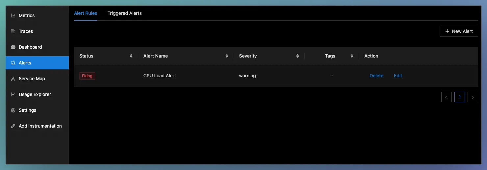
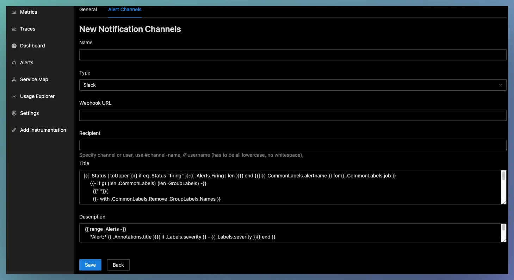
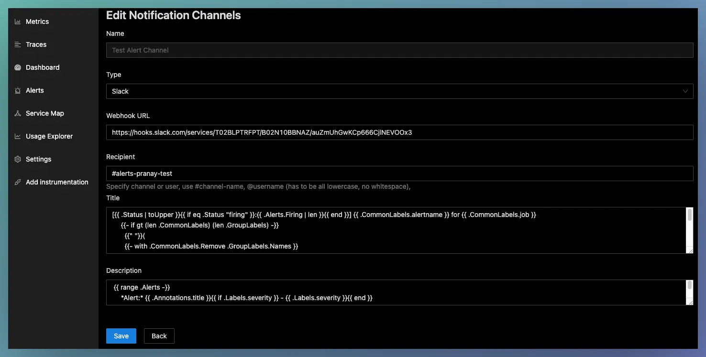

import { LiteYoutubeEmbed } from "react-lite-yt-embed";

# Setting alerts in SigNoz  

With [v0.5.0](https://github.com/SigNoz/signoz/releases/tag/v0.5.0) you can set alerts in SigNoz.

## Setting Alert Rules

Alerts in SigNoz are heavily inspired by how Prometheus manages alerts, as we found that as the most flexible way of setting alerts. So, if you have set up alerts in Prometheus, the following should sound very familiar.

Navigate to Alerts page from the left panel. It has 2 tabs:

1. Alert Rules
2. Triggered Alerts

#### Alert Rules

Alert Rules set the expression you want to evaluate to start firing alerts. The Alert Rules tab shows a list of currently configured alert rules and labels like `severity` and `Alert Name`. It also shows the current status of this Alert rules. If any alerts are `firing` because of this or everything is `Ok`

#### Create Alert Rules

To create new alert rules, you can click the `New Alert Rules` button. This would open a Prometheus like Alert rule editor for you. If you haven't used Prometheus before, don't worry this is pretty simple.

- Set the expression you want to evaluate to true to trigger alerts
- Set the period for which you want to wait (after the expression is true) to start firing alerts
- Set labels like `severity` to communicate how severe the issue is if this alert starts firing

#### Triggered Alerts

Triggered alerts show the alerts which are in `firing` or `pending` state. 

Pending means that the rule threshold is crossed, but it is still waiting based on the specified time period. Once the specified time is passed, the alert starts firing.

It also has different tags like alert name, severity, since when the alert started firing, etc.

- Filtering and grouping Triggered alerts

You can also filter and group triggered alerts based on tags. The filtering field accepts multiple key-value pairs like `serverity:warning`

For grouping, you can use any of the tags like `severity`, `alertname` or any other label you would have specified in your alert rule. You can use the grouping feature to group the list of triggered alerts based on these tags.

## Setting Notification channel

You can setup notification channels for sending the generated alerts to other applications. Currently, We support the following channels: 
- Slack ([v0.5.0](https://github.com/SigNoz/signoz/releases/tag/v0.5.0) onwards)
- Webhook ([v0.7.4](https://github.com/SigNoz/signoz/releases/tag/v0.7.4) onwards)
- Pagerduty (coming soon)

We are also working towards adding more channels (like OpsGenie, Email) in the upcoming releases.

The alert channel tabs can be accessed from `Settings > Alert Channels` tab. This shows a list of configured alert channels. When multiple channels are setup, the alerts will be sent to all the configured channels.

### Configure Slack 
#### Pre-requisite
For setting up Slack as a notification channel, you need to first configure an Incoming Webhook in Slack. The following article explains how to do that - [Sending messages to slack using Incoming Webhook](https://api.slack.com/messaging/webhooks)

#### Creating a new Notification channel

You have to provide a name, webhook URL and channel name (with # prefix) to configure a notification channel. 

Using _Test_ button you can also verify your configuration. When you click the button, a test alert will be sent to the configured slack channel.

#### Editing a Notification channel

You can edit slack webhook URL or other parameters except the channel name and channel type. 

#### Receive Alert in Slack

Once everything is set up correctly, you should see your alerts in the configured slack channel whenever the monitored metrics cross the threshold specified in the alert rules.

Now you can stay relaxed that SigNoz will promptly alert you whenever something goes wrong in any of your applications or infra components.

### Configure Webhook 
#### Pre-requisite
#### Creating a new Notification channel
#### Editing a Notification channel
#### Receive Alert in Slack

## Demo video 

Whew! That was a lot of instruction to follow. If you instead prefer to see how it works in a demo environment, here you go 👇

&nbsp;

<LiteYoutubeEmbed id="HBLtC3UKpmA" mute={false} />

&nbsp;

