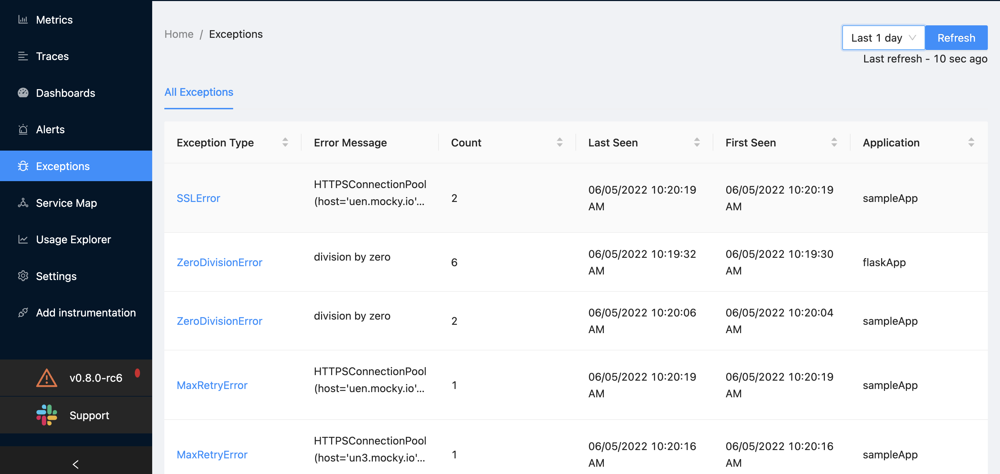
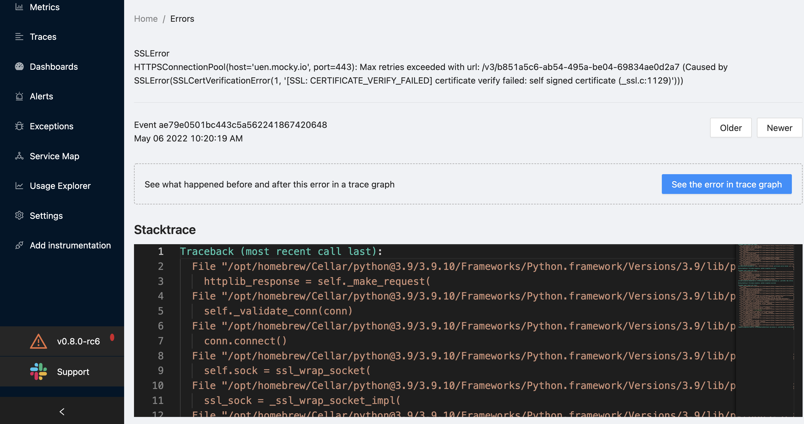
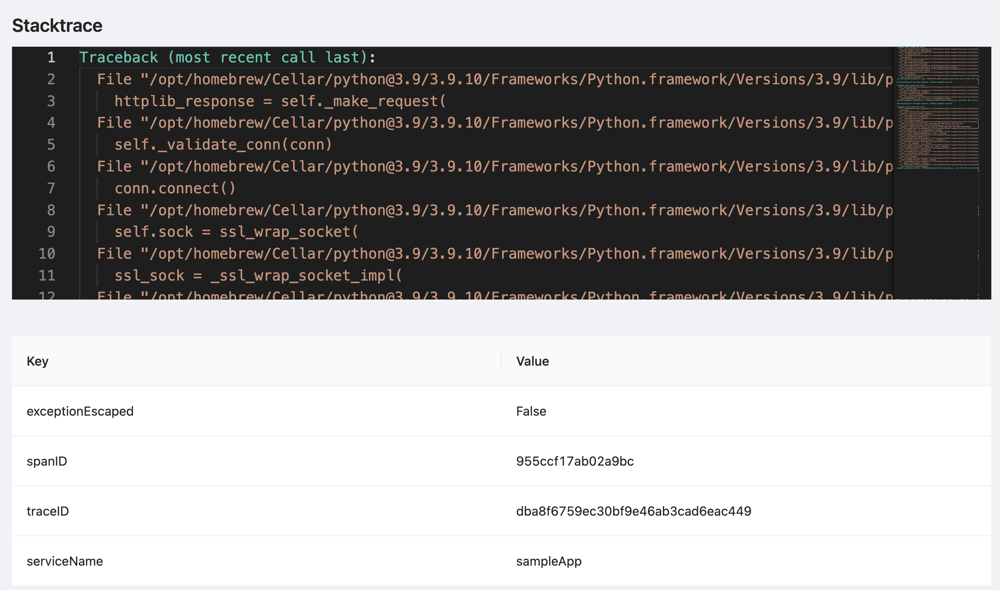

## Recording exceptions

Languages that support auto instrumentations(Python, Java, Ruby, Javascript) automatically record exceptions. For other languages, we need to record exceptions manually. Also, in some cases even for an auto-instrumented app, you may want to record custom exceptions manually.

To manually record exceptions, we need to get the span from the tracer and then call a function called `recordException()` or `recordError()` which varies across languages. Also, you can set the status of the span to `error` if the exception means the operation results in an error state.

Below are examples of how to record exceptions in different languages.

### Record Exceptions in Java:

```java
// Get the current span from the tracer
Span span = Span.current();

// recordException converts a Throwable into a span event.
span.recordException(new RuntimeException("Something went wrong"));

// Set the status of the span to error
span.setStatus(StatusCode.ERROR, "Something bad happened!");
```

### Record Exceptions in Golang:

```go
import "go.opentelemetry.io/otel/codes"

// Get the current span from the tracer
span := trace.SpanFromContext(ctx)

// RecordError converts an error into a span event.
span.RecordError(err)

// Mark span as failed.
span.SetStatus(codes.Error, "internal error")
```

### Record Exceptions in Python:

```python
# Get the current span from the tracer
from opentelemetry import trace
from opentelemetry.trace.status import Status, StatusCode

span = trace.get_current_span()

# record_exception converts the exception into a span event. 
exception = Exception("Something went wrong")
span.record_exception(exception)

# Update the span status to failed.
span.set_status(Status(StatusCode.ERROR, "internal error"))
```

### Record Exceptions in JavaScript:

```javascript
// Get the current span from the tracer
const span = api.getSpan(api.context.active());

// recordException converts the error into a span event. 
span.recordException(err);

// Update the span status to failed.
span.setStatus({ code: api.SpanStatusCode.ERROR, message: String(err)});
```

### Record Exceptions in .NET:

OpenTelemetry .NET provides several options to report Exceptions in Activity. It varies from the most basic option of setting Status, to fully recording the Exception itself to activity. Follow opentelemetry .NET [documentation](https://github.com/open-telemetry/opentelemetry-dotnet/blob/main/docs/trace/reporting-exceptions/README.md) to learn more.

Below is one such example:

```csharp
using (var activity = MyActivitySource.StartActivity("Foo"))
{
    try
    {
        Func();
    }
    catch (SomeException ex)
    {
        activity?.SetStatus(ActivityStatusCode.Error, ex.message);
        activity?.RecordException(ex);
    }
}
```

### Record Exceptions in Ruby:

```ruby
# Get the current span from the tracer
span = OpenTelemetry::Trace.current_span

rescue Exception => e
  # Record the exception and update the span status.
  span.record_exception(e)
  span.status = OpenTelemetry::Trace::Status.error(e.to_s)
end
```

### Record Exceptions in PHP:

```php

//start a root span
$rootSpan = $tracer->spanBuilder('root')->startSpan();
//future spans will be parented to the currently active span
$rootScope = $rootSpan->activate();

try {
    $span1 = $tracer->spanBuilder('foo')->startSpan();
    $span1Scope = $span1->activate();

    try {
        $span2 = $tracer->spanBuilder('bar')->startSpan();
        echo 'OpenTelemetry welcomes PHP' . PHP_EOL;
        $span2->end();
    } finally {
        $span1Scope->detach();
        $span1->end();
    }
} catch (Throwable $t) {
    //The library's code shouldn't be throwing unhandled exceptions (it should emit any errors via diagnostic events)
    //This is intended to illustrate a way you can capture unhandled exceptions coming from your app code
    $rootSpan->recordException($t);
} finally {
    //ensure span ends and scope is detached
    $rootScope->detach();
    $rootSpan->end();
}
```

## How to View Exceptions?
The Exceptions tab shows list of exceptions which applications encounter. 

It shows the list of exceptions in the applications in a separate page so that users can access them easily. It is also linked to trace pages through which you can see where in a trace is a request facing an exception

You can sort exceptions by Last Seen, First Seen, Count, Exception type and Application name



Exception detail page includes the stack trace of the exception, exception attributes and link to the span which caused the exception.



By clicking `errors in the trace page` you can see the exceptions in the context of the trace request in which the exception was thrown


