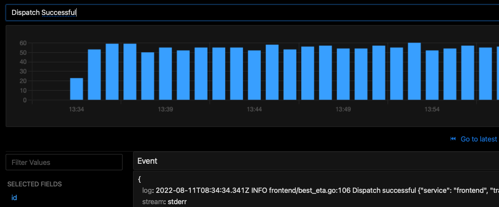

# Logs Query Builder

This page will walk you through the query language that is used by SigNoz for filtering logs.

This query language for logs is a simplified version of SQL. The current state of the query language is good enough for daily uses. As of now we don't support nesting and parenthesis for explicit ordering due to added complexity. 

If you have a use case which you are not able to fullfill with the current features please reach out to us on our slack community or Github issues. We plan to improve the query as we go forward while keeping it simple 

## Types of queries supported by SigNoz:
*  **Freehand query**   
    When a user writes a plan text query without using any kind of operators, the query is directly searched against the log body. ( inefficient over huge log data)

    eg:-`Dispatch Successful`
    
    
        
*  **Filtering queries**   
    When a user writes queries using a `key`, `operator` and  a `value` separated by `and` , `or` operators it is a filtering query.
    This kind of queries are faster as they reduce the search space by using indexes.
    
    eg:- `id IN ('2DCVZOsKHioCeuvbObzVzzL1eZ5') AND fulltext contains 'Dispatch Successful'`
    
    
        
## List of Operators supported by SigNoz
* Here is a list of all the operators that are supported:

    | Operator  | Multivalued | Examples                                           | Meaning |
    |-----------|-------------|----------------------------------------------------|---------|
    | IN        | yes         |  num in (1,2,3)   strdata in ('a', 'b', 'c')   | In |
    | NIN       | yes         |  num nin (1,2,3)   strdata nin ('a', 'b', 'c') | Not In |
    | GTE       | no          |  num gte 10   dict_word gte 'cat'              | Greater than or Equal to |
    | GT        | no          |  num gt 10   dict_word gt 'cat'                | Greater than |
    | LTE       | no          |  num lte 10   dict_word lte 'cat'              | Less than or Equal to |
    | LT        | no          |  num lt 10   dict_word lt 'cat'                | Less than |
    | CONTAINS  | no          |  stream contains 'err'                            | Contains |
    | NCONTAINS | no          |  stream ncontains 'err'                           | Doesn't Contain |
    
## Fulltext Key
    
The fulltext key is used when we want to write freehand queries and combine them with filters.

eg:- `id IN ('2DCVZOsKHioCeuvbObzVzzL1eZ5') AND fulltext contains 'Dispatch Successful'`

In this cases we are searching `Dispatch Successful` as fulltext along with the id filter.

Note:- The `fulltext` keyword can be only used with `contains` and the `ncontains` operator.
    

## Pointers to note while writing queries
- Text always needs to be **enclosed in single quotes** in **filtering queries**

    eg:-
    If you want to search for logs with stream error and which contains Mozilla in body, the corresponding query on the ui will be 

    `id IN ('2DCVZOsKHioCeuvbObzVzzL1eZ5') AND fulltext contains 'Dispatch Successful'`

    as we can see `Dispatch Successful` is enclosed in single quotes as well as the Id.

- Order of execution is similar to sql i.e left to right and `and` has higher precedence over `or` , but currently SigNoz doesn’t support combining explicitly using parenthesis.
    
    **correct** :-`stream IN ('stdout') and fulltext contains 'Mozilla' or stream IN ('stderr')` ✅

    **incorrect** :- `(stream IN ('stdout') and fulltext contains 'Mozilla') or stream IN ('stderr')` ❌ 
    
    while the above to evaluates to the same expression, it’s not necessarily same for the one below
    
    **correct** :-`stream IN ('stdout') and fulltext contains 'Mozilla' or stream IN ('stderr'` ✅
    
    **incorrect** :- `stream IN ('stdout') and (fulltext contains 'Mozilla' or stream IN ('stderr'))` ❌ 
    
    here both the statements are not equivalent of each other **i.e it is currently not supported**

## Query Examples

Here are a few examples of valid and invalid queries:

* **Valid Queries**

    | Query                                                      | Description                   |
    |------------------------------------------------------------|-------------------------------|
    | OPERATION in ('add') AND FULLTEXT contains 'search string' | fulltext with filtering query |
    | my fulltext search                                         | fulltext search query         |
    | status gte 200 AND FULLTEXT contains 'search string'       | fulltext with filtering query |
    | service IN ('name>100') AND length GT 100                  | filtering query               |
    | service IN ('name > 100') AND name GT 'myname'             | filtering query               |
    | hello in 2                                                 | fulltext search query         |
    | hello in (2,3)                                             | filtering query               |
    | hello lt 2                                                 | filtering query               |

* **Invalid Queries**

    | Query                                                             | Description                             |
    |-------------------------------------------------------------------|-----------------------------------------|
    | OPERATION in ('bcd') AND 'abcd' FULLTEXT contains 'search string' | AND missing between 'abcd' and FULLTEXT | 
    | OPERATION in ('bcd') AND 'search string'                          | Operator missing before 'search string' | 
