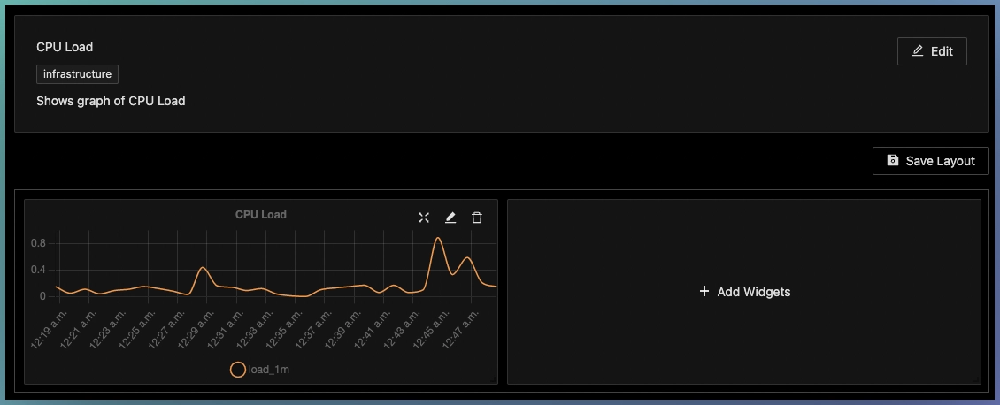
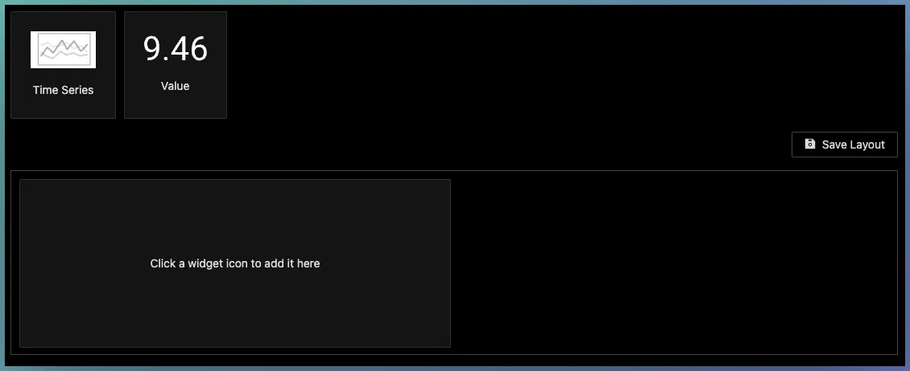
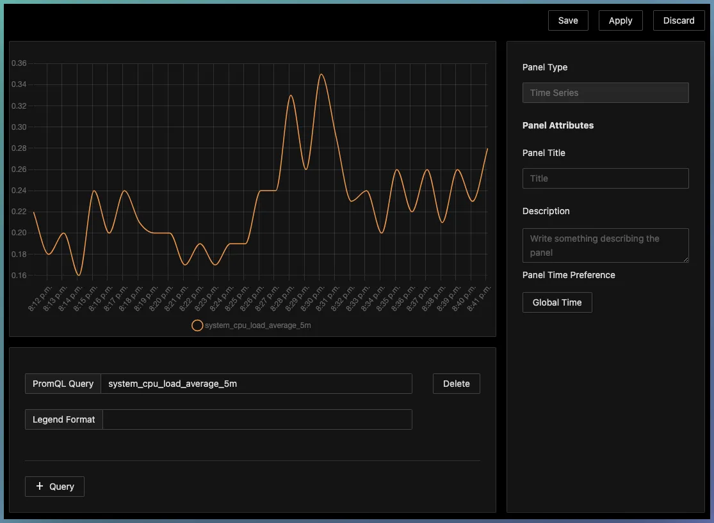
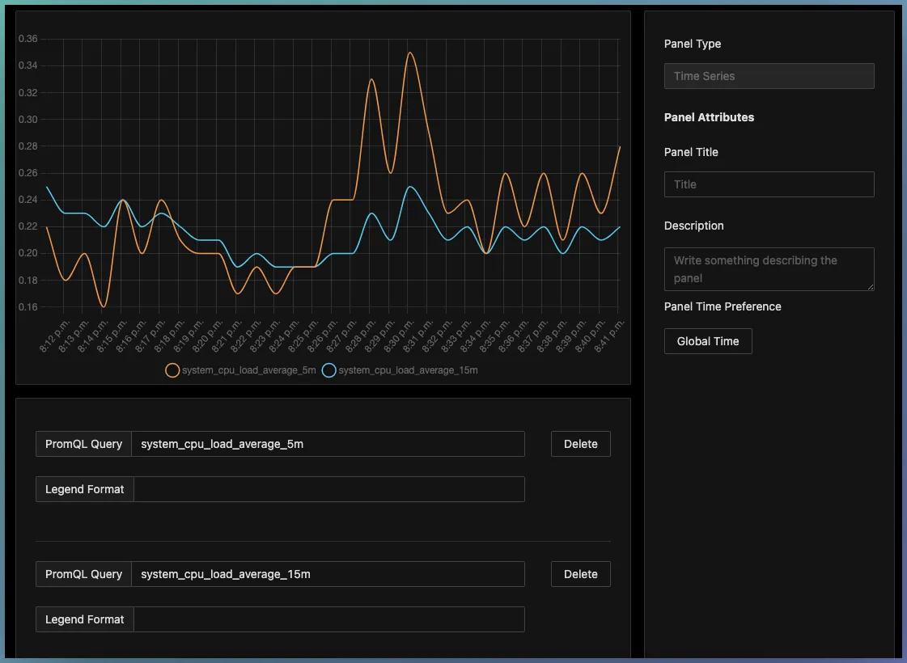

You can create dashboards to visualise metrics you send to SigNoz.

By default, SigNoz comes with hostmetrics enabled in opentelemetry receiver. 

So you have following metrics like `system_cpu_load_average_1m`,`system_memory_usage_total` available by default. A complete list of available metrics is given in the [table below](#metrics-from-hostmetrics-receiver).

### Selecting the panel type

SigNoz currently supports 2 type of panels.
1. Time Series - For time series data
2. Value - For single numerical value

- Based on the datatype you are looking to visualise, you should select `Time Series` or `Value`

- On selecting the type of panel, a panel builder page opens up

### Steps to create a graph

- Just type in the metric you want to graph by editing the `PromQL Query` field and format the legend as needed using the `Legend Format` field.

- Once you type a correct query and click anywhere out side the Query box, the graphg would be plotted.

- You can set `Panel Time Preference` to match to Global Time or set specific time intervals. If you select the time interval shown in the graph would change based on the global time filter selected in top right corner time selector. 

- If you select a specific time period say `15 min` the time interval shown in the panel will be `15 min` irrespective of the time period selected in the Global time filter.

- If this looks like what you want, you can save the dashboard by giving it a name and adding a suitable description.

- You can also plot multiple queries in the same panel by using `+ Query` button and adding a new metric to plot in `PromQL Query` field.

### Steps to enable more receivers and metrics

- You can configure which receivers and metrics you want to enable by changing [these](https://github.com/SigNoz/signoz/blob/53d52254cb94d305a81763f8852bbd645adf79c1/deploy/docker/clickhouse-setup/otel-collector-config.yaml#L14) lines in otel collector config file.

  You can change the receivers enabled and corresponding scrapers.

- More details on Host Metric receiver [here](https://github.com/open-telemetry/opentelemetry-collector-contrib/blob/main/receiver/hostmetricsreceiver/README.md)

- You can also configure more receivers by adding them in the above file. List of receivers available in opentelemetry can be found [here](https://github.com/open-telemetry/opentelemetry-collector-contrib/tree/main/receiver)

:::note

Ping us on [slack](https://bit.ly/signoz-slack) or email on [support@signoz.io](mailto:support@signoz.io) if need any help in enabling different metrics/receivers.

:::

### Metrics from Hostmetrics receiver

Some metrics available if hostmetrics is enabled. This is enabled in SigNoz default installation.

| Metrics | Description |
| --- | ----- |
| `system_filesystem_usage_total` | |
| `system_network_dropped_total` | |
| `system_cpu_time_total` | |
| `system_disk_merged_total` | |
| `system_disk_io_time_total` | |
| `system_disk_operations_total` | |
| `system_network_errors_total` | |
| `system_network_io_total` | |
| `system_disk_weighted_io_time_total` | |
| `system_network_packets_total` | |
| `system_disk_operation_time_total` | |
| `system_cpu_load_average_5m` | |
| `system_memory_usage_total` | |
| `system_disk_pending_operations_total` | |
| `system_disk_io_total` | |
| `system_cpu_load_average_15m` | |
| `system_cpu_load_average_1m` | |

