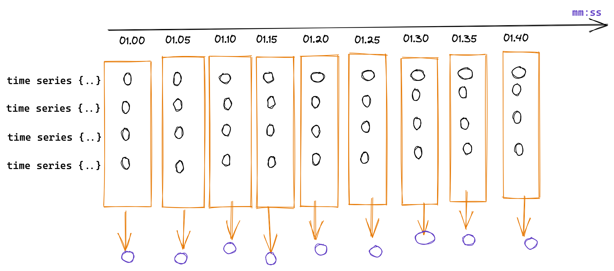
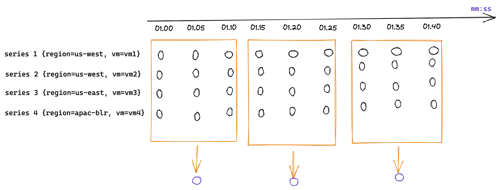
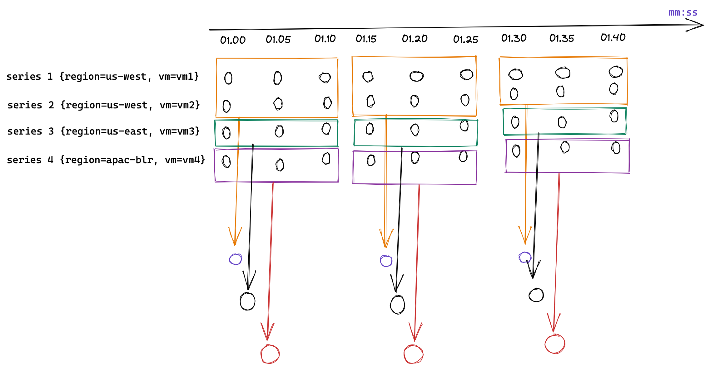

import GetHelp from '../shared/get-help.md'

Let's start by understanding some concepts first and terminology.

## Concepts

A metric is a set of measurements of a resource annotated by one or more attributes. Measurements might include the number of requests served, duration of the request, the current room temperature, the number of items in the queue, and so forth. Resources might include virtual machines (VMs), database instances, disks, and so forth.

There are primarily three concepts the reader must understand

1. Time series
2. Samples/Measurements
3. Metric type

#### Time series

A time series is identified by a metric name and set of attributes, ex queue_length{k1=v1,k2=v2}.

#### Samples/Measurements

A sample or measurement is the value observed for the metric at a point in time. It can be thought of as
a tuple (value, timestamp).

#### Metric type

A metric type describes measurements of nature emitted by a resource and how the measurements are interpreted and aggregated. The most commonly used metric types are Sum, Gauge, and Histogram. A Sum metric type is used for counting things that are monotonically increased over time. A guage metric is used when the value changes arbitrarily without any monotonic guarantees. A Histogram metric is used to convey a population of recorded measurements into buckets.

Now that you have basic knowledge of the topic, let's dive into the query builder.

## Anatomy of the query builder

A query builder in SigNoz consists of six important components:

- Data source: The source of data to query (only metrics are supported now)
- Metric name: Name of metric you want to query
- Where clause: Apply the selection criteria to reduce the amount of data to process.
- Group By: Group the measurements based on some attributes.
- Aggregate operator: Apply some function to reduce the samples to a single value.
- Functions: Mathematical functions to transform the time series result.

Let's take a look at some important clauses in detail, and how they can be useful with some real-world examples.

### Where clause

The volume of the metric data in a single time series can be huge. There are two verticals by which you can limit the data. They are time and tags. You can use the global time filtering dropdown to select the range of time to query metic and the *WHERE* clause in the query builder to include/exclude certain tags from the result. For example, you may only want to look at the HTTP requests from service=foo and http_status_code=500 in the last one hour.

There are four operators supported.

1. IN
2. NIN
3. LIKE
4. NLIKE

*IN* and *NIN* operators can be used as an alternative for = and != with just a single value.

### Group By

Grouping allows you to aggregate samples across subsets of your time series rather than across the entire set of time series. By default, the aggregation is applied to the entire set of time series. You can select one or more labels from the **Group By** clause. The grouping is applied based on label values.

For example, you might have some metric *A* which has different cloud regions, virtual machines, and CPU types. You might be only interested in analyzing the data region-wide and you can do that by selecting the region tag.

### Aggregate operator

The amount of data after applying the time and tag filters is still huge and can't be interpreted in a meaningful way. We need to reduce this data by aggregating it over time and dimensions. There are two kinds of aggregation you could perform on the metric data. They are temporal aggregation and spatial aggregation.

#### Temporal aggregation

Temporal aggregation refers to the idea that metrics that are collected at a high frequency can be re-aggregated into longer intervals, allowing low-resolution time series to be pre-calculated or used in place of the original metric data. SigNoz auto-adjusts this interval based on the time range selected to limit the number of points to be plotted on the chart. 

The following diagram shows the aggregation of data into intervals of 10 seconds

#### Spatial aggregation

Spacial aggregation refers to the idea that metrics that are produced with unwanted attributes can be re-aggregated into metrics having fewer attributes. 

The following diagram shows the aggregation of the entire set of time series into a single value at each interval of time.

A metric can contain a huge number of time series and it's not practical to analyze each one of them. When you work with query builder it applies the aggregation over the entire set of time series using the auto-adjusted granularity of time intervals to show you the trends in your data. The following diagram illustrates that.

But that might not be something you are always interested in, you could re-aggregate the data by selecting one or more tags from the **Group By** clause. Say you are interested in looking at the trends of the same metric by region it would result in three different time series one for each region and aggregation is applied to each region's data for every interval of time.

There are several aggregator operators you can choose to summarize your data. Following is the list of supported operators

- NOOP (No aggregation)
- COUNT (Number of values in each bucket of data)
- COUNT_DISTINCT (Number of distinct values in each bucket of data)
- SUM (Sum of all the values)
- AVG (Average of all the values)
- MAX (Maximum of all the values)
- MIN (Minimum of all the values)
- P05 (5th percentile of values)
- P10 (10th percentile of values)
- P20 (20th percentile of values)
- P25 (25th percentile of values)
- P50 (50th percentile of values)
- P75 (75th percentile of values)
- P90 (90th percentile of values)
- P95 (95th percentile of values)
- P99 (99th percentile of values)
- RATE (Rate of change of value for each time series)
- SUM_RATE (Sum of the rate of change of each time series)
- RATE_SUM (Rate of change on sum aggregated values)
- RATE_AVG (Rate of change on avg aggregated values)
- RATE_MAX (Rate of change on maa aggregated values)
- RATE_MIN (Rate of change on min aggregated values)

The above figures should make it easier to understand how these aggregator operators are applied to metric data and what the resulting time series shows.

## Functions

Functions can be used to manipulate the result time series using mathematical operations. It could be as simple as A/2 or some complex expression. Below is the list of mathematical functions supported.

- *exp*, *log*, *ln*, *exp2*, *log2*, *exp10*, *log10*, *sqrt*, *cbrt*, *erf*, *erfc*, *lgamma*, *tgamma*, *sin*, *cos*, *tan*, *asin*, *acos*, *atan*, *degrees*, *radians*

## Get Help

<GetHelp />

